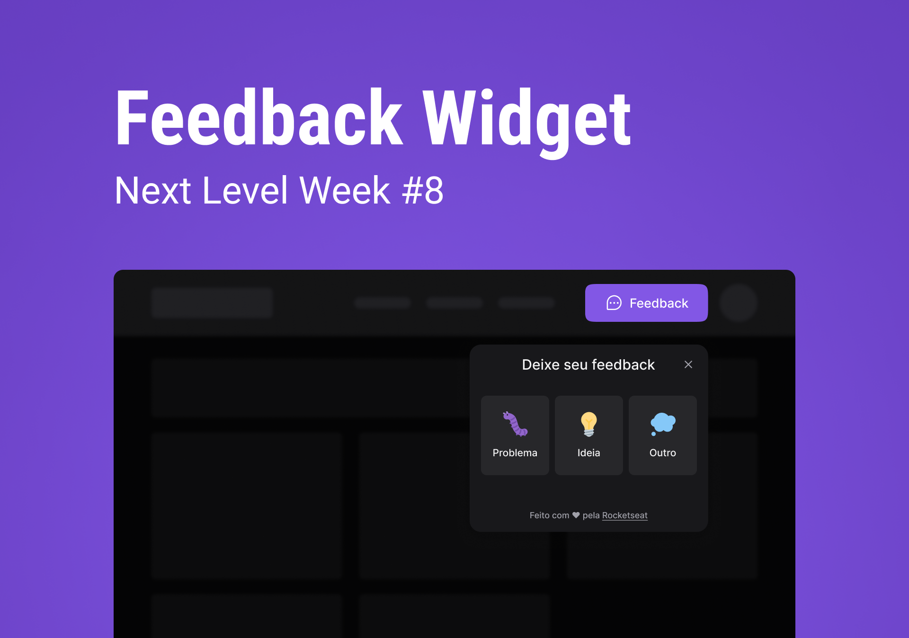

<div align="center">
    
</div>

&nbsp;
## 📃 Summary
[About](#about)<br />
[Technologies used](#tech)<br />
[Setup](#setup)<br />

&nbsp;
<a name="about"></a>
## 🤔 About
It's a project coded during #8 edition of NLW, named NLW Return, from Rocketseat. This monorepo contain all the project code.

&nbsp;
<a name="tech"></a>
## 🤯 Technologies used
- TypeScript
- React
- React Native
- Prisma
- PostgreSQL (for production)
- SQLite (for development)
- Expo
- Express
- ViteJS
- Tailwind CSS

&nbsp;
<a name="setup"></a>
## 🔧 Setup
- Clone this repository:
```bash
git clone https://github.com/z3oxs/nlw-return
cd nlw-return
```

&nbsp;
### 🌎 Web
#### Development
```bash
yarn dev
```

#### Production
```bash
yarn build && yarn preview
```

&nbsp;
### 📱 Mobile
```bash
yarn start
```

&nbsp;
### ⚙️ Server
#### Development
1. Set the provider in `prisma/schema.prisma` to `"sqlite"`
2. Set the `DATABASE_URL` of `.env` to `"file:./dev.db"`
3. Run `yarn dev`

#### Production
1. Set the provider in `prisma/schema.prisma` to `"postgresql"`
2. Set the `DATABASE_URL` of `.env` to your PostgreSQL URI
3. Build with `yarn build`
4. Run `yarn start`